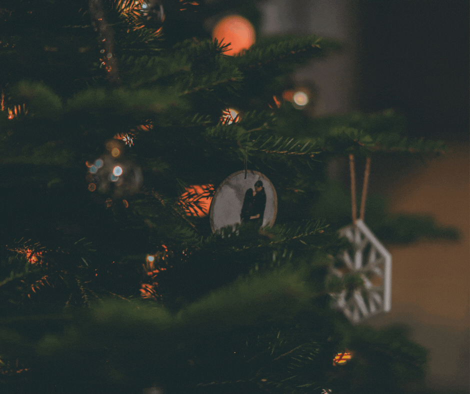

# 🎄 Dear Santa App 🎄



This project has been initialized with `express-generator`. It already has `mongoose` and `nodemon` installed, so all that's left to do is:
```bash
npm install
````

To run the app, run:
```bash
npm run dev
```
There is also a connection to the database, called *dear santa*.

> 🎁 The goal of this app is to perform as a present list, either for yourself or for other people. Everytime you think of something you might like as a gift, you should be able to add a new present, see all the presents, and see the present's detail.

## Iteration 1: Seed database

- Create the model for `Present`. Here is an example of what every present should look like:

```js
{
  name: 'Lego Star Wars: Death Star',
  image: 'https://i.ebayimg.com/images/g/Wb4AAOSwuPdifpxC/s-l640.jpg',
  price: 850,
  recipient: 'Ale',
  description: 'This amazingly detailed battle station features an incredible array of minifigure-scale scenes, moving parts, characters and accessories from Episodes IV and VI.'
}
```

⚠️ You can add more properties if you'd like, but you can't delete these basic ones.

- Create an array of 5 presents of your choosing inside the `/db` folder, in a file called `data.js`. Remember to export it.
- Create a `seed.js` file inside the folder `/db`. Write the code necessary to make sure this file inserts the array of presents (which you'll have to import) into our database. You will need to import the `Present` model as well.
- Create a script called `npm run seed` that will execute `node ./db/seed`.
- Run the command and make sure in Compass that your database is seeded.

----
## Iteration 2: GET routes 👀

Your app should have the following routes:

### 1. GET /presents

This route should display a list of **partials** for each one of the presents, with:
- All the names of the presents
- The image of each present
- A link to the details

> 💡 Remember to register your partials

### 2. GET /presents/:id

- This route should display all the details of the present.
- Add a `nav` in the layout to make sure the user can go back to the list of presents

--- 
## Iteration 3: POST routes 🆕

### 1. GET /presents/new

- This route should display a form for the user to introduce the details of the new present

### 2. POST /presents/new

- This route should receive the data from the previous form
- Should create a new present in the database
- Should redirect the user to the list with all the presents

---

## Iteration 4: DELETE route 🗑️

### GET /presents/delete/:id

- On the /presents view, each one of the cards should have a button to delete the document
- Once the present is deleted, the user should be redirected to the /presents route

---

## Iteration 5 (not a bonus): styling 🎨

Add styles to all the views

---

## Bonus: search bar 🔎

- Add an input on the /shows view
- Create a `search` view to display the search results
- The route displaying the search view should get the query (you can use any value you consider fit to perform the search in the DB) and should display the results in the search view


